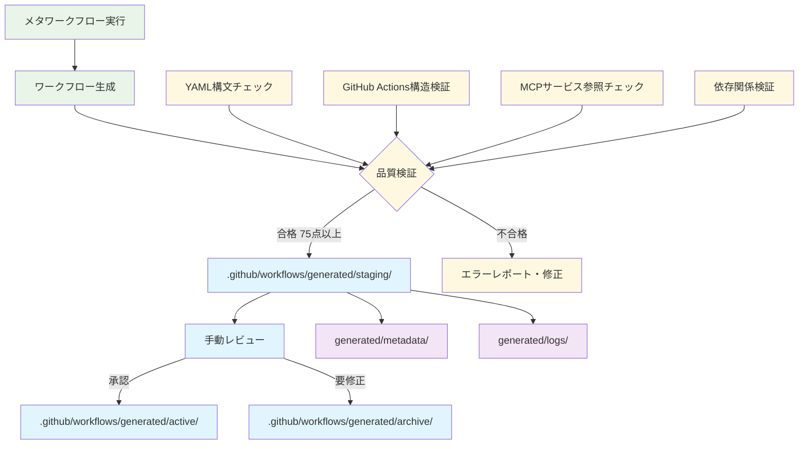

# Meta Workflow Generator System (Kamui Rossy)

🤖 **Claude Code GitHub Actions統合**によるメタワークフロージェネレーターシステム

## 概要

このシステムは、ユーザーのリクエストに基づいて完全なワークフローを自動生成するメタワークフロージェネレーターです。**テンプレートベース生成**と**段階的格納システム**により、高品質で実行可能なGitHub Actionsワークフローを効率的に生成します。

## 🏗️ **アーキテクチャ**

### **モジュラー・メタワークフローシステム**
- **プロンプト分離**: すべてのプロンプトは`meta/prompts/`で外部管理
- **小さなノード**: 各ジョブが単一責任を持つ
- **確実な実行**: 各ステップの検証を経てから次に進む
- **再実行可能**: 失敗したジョブの独立した再実行が可能

### **核心コンポーネント**
- **`meta/prompts/`**: タスク分解、ワークフロー生成、スクリプト生成、ドキュメント用プロンプト
- **`.github/workflows/kamuicode-meta-generator.yml`**: メインメタワークフロー
- **`.github/ISSUE_TEMPLATE/`**: ワークフロー要求用Issueテンプレート
- **`meta/examples/`**: 9種類の詳細参考ワークフロー
- **生成出力**: 完全なワークフロー、スクリプト、ドキュメント

## 📁 **ディレクトリ構成**

```
.github/
├── workflows/
│   ├── kamuicode-meta-generator.yml     # メインメタワークフロー
│   ├── continuous-monitoring.yml        # システム監視ワークフロー
│   ├── real-time-fix-deployer.yml      # 自動修復デプロイ
│   └── auto-fix-deployment.yml         # 自動修正デプロイ
├── ISSUE_TEMPLATE/
│   └── workflow-request.yml            # ワークフロー要求テンプレート

meta/
├── examples/                           # 参考ワークフローテンプレート (9種類)
│   ├── README.md                       # 各ワークフローの詳細説明 + Mermaid図式
│   ├── video-content-creation.yml      # 動画コンテンツ制作 (14タスク・45分)
│   ├── multimedia-ad-campaign.yml      # マルチメディア広告 (16タスク・60分)
│   ├── 3d-model-creation.yml          # 3Dモデル生成 (10タスク・30分)
│   ├── image-generation.yml           # 画像生成 (8タスク・20分)
│   ├── audio-music-creation.yml       # 音楽制作 (11タスク・35分) 
│   ├── presentation-slide-creation.yml # プレゼン作成 (12タスク・40分)
│   ├── data-analysis-visualization.yml # データ分析 (8タスク・45分)
│   ├── news-summarization.yml         # ニュース要約 (6タスク・25分)
│   └── blog-article-creation.yml      # ブログ記事 (9タスク・35分)
├── prompts/                           # プロンプトファイル
│   ├── task-decomposition.md         # タスク分解
│   ├── workflow-generation.md        # ワークフロー生成 
│   ├── script-generation.md          # スクリプト生成
│   ├── documentation-generation.md   # ドキュメント生成
│   └── templates/                    # プロンプトテンプレート
│       └── task-prompt-template.md
├── docs/                             # システムドキュメント
│   └── claude-code-vs-mcp-guidelines.md

.github/workflows/generated/           # 生成ワークフロー配置場所（簡素化）
├── active/                          # 現在有効なワークフロー
│   └── *.yml                        # アクティブワークフロー
├── staging/                         # 検証済みワークフロー（無効化）
│   └── *.yml.disabled               # テスト完了・手動有効化待ち
└── archive/                         # 過去バージョン履歴
    └── *.yml                        # 履歴保存

generated/                           # 生成メタデータ・ログ
├── metadata/                        # メタデータ・分析結果（永続保存）
│   ├── stepback-analysis/           # ステップバック質問分析
│   ├── requirement-analysis/        # 要件分析結果
│   ├── task-decomposition/          # タスク分解結果  
│   └── evaluation/                  # 評価・選択結果
├── logs/                           # 実行ログ（各run-XX-タイムスタンプ）
│   └── run-[番号]-[タイムスタンプ]/  # 実行サマリー・フェーズログ・Artifact内容
├── artifacts/                      # 一時的なアーティファクト（従来）
├── evaluation/                     # 評価結果（従来）
└── task-plans/                     # タスクプラン（従来）

script/                              # 実行スクリプト
├── lib/
└── monitor-workflows.sh            # ワークフロー監視スクリプト

config/                             # 設定ファイル
docs/                               # プロジェクトドキュメント
```

## 🚀 **使用方法**

### **実行方法**
1. **Issue駆動**: 専用テンプレートでIssueを作成
2. **手動実行**: `workflow_dispatch`トリガーで直接実行

### **MCP設定**
- `.claude/mcp-kamuicode.json`設定ファイルが必要
- AI生成サービス (T2I, T2V, I2V, T2M, V2A, I2I3D) へのアクセス

### **実行例**
```bash
# Issues経由
gh issue create --template workflow-request.yml --title "商品紹介動画作成"

# 手動実行  
gh workflow run kamuicode-meta-generator.yml -f workflow_type=video-generation -f description="商品紹介動画を作成"
```

## 🎯 **段階的格納システム (v8.1)**

### **3段階品質保証プロセス + 永続保存**



### **検証項目**
- ✅ **YAML構文チェック** (yamllint + Python fallback)
- ✅ **GitHub Actions構造検証** (name/on/jobs必須)
- ✅ **MCPサービス参照検証** (実際の設定と照合)
- ✅ **依存関係チェック** (循環参照防止)
- ✅ **総合スコア判定** (75点以上で合格)

## 📁 **generated/ ディレクトリ詳細**

### **ファイル保存場所とアクセス方法**

#### **📂 最終成果物**
```bash
# アクティブワークフロー（手動有効化済み）
.github/workflows/generated/active/*.yml

# ステージングワークフロー（検証済み・無効化）
.github/workflows/generated/staging/*.yml.disabled

# 履歴保存
.github/workflows/generated/archive/*.yml
```

#### **📋 実行ログ・デバッグ情報**
```bash
# 実行ログディレクトリ
generated/logs/run-[番号]-[タイムスタンプ]/
├── execution-summary.md      # 実行サマリー（Run ID、スコア等）
├── execution-phases.log      # 各フェーズの完了状況
└── [Artifact内容]           # 全Artifactの内容

# メタデータ・分析結果
generated/metadata/
├── stepback-analysis/        # Issue本文・ステップバック分析
├── requirement-analysis/     # 要件分析・プロンプト
├── task-decomposition/       # タスク分解結果
└── evaluation/              # アプローチ評価・選択結果
```

#### **🔄 ワークフロー配置プロセス**
```bash
# 生成・検証プロセス
generated/metadata/          # プロセス情報・ログ
generated/logs/             # 実行詳細ログ

# 最終配置場所（簡素化）
.github/workflows/generated/
├── staging/     # 検証済み（.disabled拡張子）
├── active/      # 手動有効化済み
└── archive/     # 過去バージョン
```

#### **📥 ダウンロード・アクセス方法**

1. **リポジトリから直接ダウンロード**
   ```bash
   # アクティブワークフローを取得
   curl -O https://raw.githubusercontent.com/[your-repo]/main/.github/workflows/generated/active/[workflow-name].yml
   ```

2. **GitHub Actions Artifacts**
   - Issue完了通知のリンクからアクセス
   - `https://github.com/[repo]/actions/runs/[run-id]`

3. **git clone で全取得**
   ```bash
   git clone [repo-url]
   cd [repo]/generated/
   ```

### **🗂️ ファイルの説明**

| ディレクトリ | 内容 | 保存期間 | 用途 |
|-------------|------|----------|------|
| `.github/workflows/generated/active/` | 有効化済みワークフロー | **永続** | プロダクション実行 |
| `.github/workflows/generated/staging/` | 検証済みワークフロー(.disabled) | **永続** | 手動有効化待ち |
| `.github/workflows/generated/archive/` | 過去バージョン履歴 | **永続** | バックアップ・参照 |
| `generated/logs/` | 実行ログ・デバッグ情報 | **永続** | 分析・トラブルシュート |
| `generated/metadata/` | 生成プロセスデータ | **永続** | 改善・最適化 |

## 🔧 **セットアップ**

### **必須シークレット**
```bash
# GitHub Repository Secrets に設定
CLAUDE_CODE_OAUTH_TOKEN=your-claude-code-token
```

### **MCPサービス設定**
```bash
# MCP設定ファイルの配置
.claude/mcp-kamuicode.json
```

### **利用可能なMCPサービス**
- **T2I**: `t2i-google-imagen3`, `t2i-fal-imagen4-ultra`, `t2i-fal-imagen4-fast`
- **T2V**: `t2v-fal-veo3-fast`
- **I2V**: `i2v-fal-hailuo-02-pro`
- **T2M**: `t2m-google-lyria`
- **V2A**: `v2a-fal-metavoice-v1`
- **V2V**: `v2v-fal-cogvideo-1_5`
- **I2I3D**: `i2i3d-fal-hunyuan3d-v21`

## 🎨 **ワークフロー例**

### **動画制作系**
- **動画コンテンツ制作**: T2V, I2V, V2A統合 (14タスク・45分)
- **マルチメディア広告**: 全MCP統合キャンペーン (16タスク・60分)

### **画像・3D制作系**  
- **3Dモデル生成**: I2I3D HunYuan3D (10タスク・30分)
- **画像生成**: T2I Imagen3/4 (8タスク・20分)

### **音声・プレゼン系**
- **音楽制作**: T2M Lyria (11タスク・35分)
- **プレゼン作成**: T2I + Google Slides (12タスク・40分)

### **データ・コンテンツ系**
- **データ分析**: GitHub API + T2I可視化 (8タスク・45分)
- **ニュース要約**: 外部API (6タスク・25分)
- **ブログ記事**: T2I アイキャッチ (9タスク・35分)

## 🔍 **システム監視**

### **自動監視機能**
- **continuous-monitoring.yml**: システム稼働状況監視
- **real-time-fix-deployer.yml**: リアルタイム修復デプロイ
- **monitor-workflows.sh**: スクリプトベース監視

### **品質メトリクス**
- ワークフロー生成成功率追跡
- 検証スコア分析
- エラーパターン学習

## 🐛 **トラブルシューティング**

### **よくある問題**
1. **ワークフロー生成失敗**
   - Claude Code認証トークン確認
   - MCP設定ファイル存在確認

2. **検証不合格**
   - YAML構文エラー修正
   - 存在しないMCPサービス参照の修正

3. **実行時エラー**  
   - 生成されたREADMEとログ確認
   - 依存関係の見直し

## 📊 **パフォーマンス**

### **効率性**
- **従来のタスク分解処理**: 複雑なAI呼び出し (2-5分)
- **テンプレートベース生成**: 高速テンプレート選択 (30秒以内)
- **段階的格納**: 品質保証付き自動配置

### **スケーラビリティ**
- 9種類の参考ワークフローテンプレート
- 並列実行対応 (最大3ジョブ同時)
- アーティファクト30日保持

## 🤝 **開発・貢献**

### **拡張方法**
1. **新ワークフロー追加**: `meta/examples/`に超詳細タスク分解を適用
2. **プロンプト改善**: `meta/prompts/`のプロンプトファイル更新
3. **検証強化**: 段階的格納システムの検証項目追加

### **コードスタイル**
- 超詳細タスク分解方式
- ファイルパス参照パターン (`jq -r '.url // .file_path // "none"'`)
- MCP統合とexternal API フォールバック

---

**Generated by Meta Workflow Generator v3 (Staged Deployment)** 🤖🔄✅

**開発者**: Kamui Rossy System  
**最終更新**: 2025-07-25  
**ライセンス**: MIT License