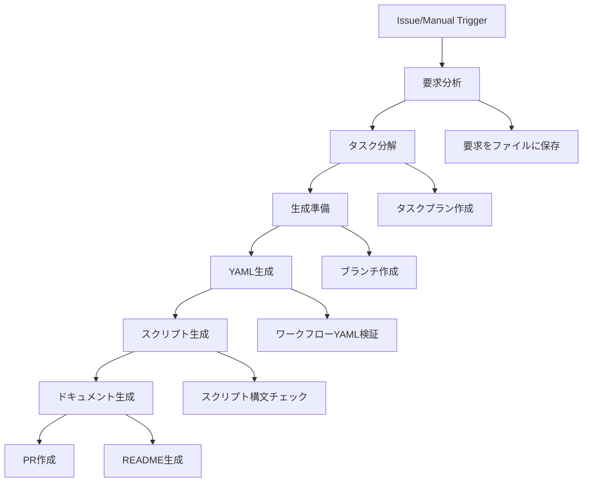

# メタワークフロー生成システム（モジュール型）

このシステムは、Kamuicodeワークフローを小さなノード単位で確実に生成するメタワークフローです。

## 🎯 特徴

### モジュール型アーキテクチャ
- **プロンプト分離**: すべてのプロンプトは外部ファイルとして管理
- **小さなノード**: 各ジョブは単一の責任を持つ
- **確実な実行**: 各ステップの成功を確認してから次へ進む
- **再実行可能**: 失敗したジョブのみを再実行可能

### 自動タスク分解
- ユーザーの抽象的な要求を具体的なタスクに分解
- 依存関係の自動解析
- 並列実行可能なタスクの識別

## 📁 ディレクトリ構成

```
.github/
├── workflows/
│   └── meta-workflow-generator.yml    # メタワークフロー
├── ISSUE_TEMPLATE/
│   └── workflow-request.yml           # リクエストテンプレート
meta/
├── prompts/                           # プロンプトファイル
│   ├── task-decomposition.md         # タスク分解用
│   ├── workflow-generation.md        # ワークフロー生成用
│   ├── script-generation.md          # スクリプト生成用
│   ├── documentation-generation.md   # ドキュメント生成用
│   └── templates/                    # プロンプトテンプレート
│       └── task-prompt-template.md
config/                               # 設定ファイル
generated/                            # 生成されたファイル
├── config/
├── prompts/
└── scripts/
script/                              # 実行スクリプト
└── lib/
docs/                                # ドキュメント
```

## 🚀 使い方

### 方法1: Issueから生成
1. 新しいIssueを作成（テンプレート使用推奨）
2. 要求を具体的に記載
3. 自動的にワークフローが生成されPRが作成されます

### 方法2: 手動実行
1. Actions → "Meta Workflow Generator"
2. "Run workflow"をクリック
3. 必要な情報を入力して実行

## 🔧 セットアップ

### 1. 必須シークレット
```bash
# GitHub Secretsに設定
CLAUDE_CODE_OAUTH_TOKEN=your-token-here
```

### 2. Kamuicode MCP設定
```bash
# 開発者提供のMCP設定ファイルを配置
cp /path/to/mcp-kamuicode.json ~/.claude/mcp-kamuicode.json
```

### 3. プロンプトファイルの準備
すべてのプロンプトファイルが `meta/prompts/` に配置されていることを確認

## 🏗️ ワークフローの実行フロー



## 📊 生成されるワークフローの特徴

### タスクベース実行
- 各タスクは独立したジョブまたはステップ
- 依存関係に基づく実行順序
- 並列実行による高速化

### エラーハンドリング
- 各タスクにリトライロジック
- フォールバック戦略
- 詳細なエラーログ

### モニタリング
- 実行状況のリアルタイム追跡
- 詳細な実行レポート
- アーティファクトによる出力保存

## 🐛 トラブルシューティング

### ワークフロー生成が失敗する
1. Claude Code認証トークンを確認
2. MCP設定ファイルの存在を確認
3. プロンプトファイルの存在を確認

### タスク分解が不適切
1. Issueの説明をより具体的に記載
2. 要件を箇条書きで明確に

### 生成されたワークフローが動作しない
1. 生成されたREADMEを確認
2. タスクプランを確認
3. ログを詳細に確認

## 🤝 貢献方法

1. プロンプトの改善はPRで提案
2. 新しいワークフロータイプの追加はIssueで議論
3. バグ報告は再現手順と共に

## 📝 ライセンス

このプロジェクトはMITライセンスの下で公開されています。