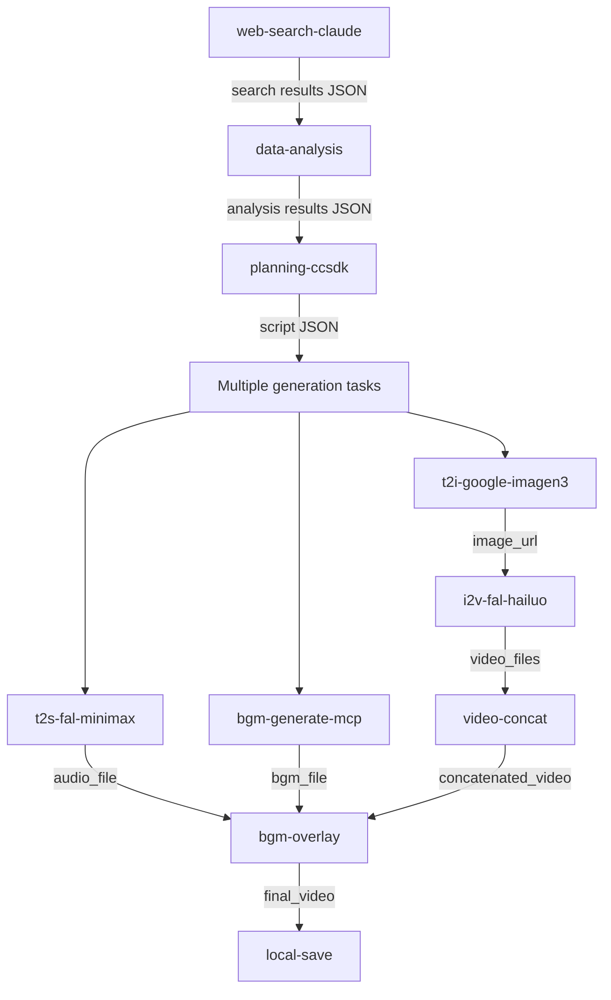

# Minimal Unit Data Dependencies Guide

This document provides guidance for managing data flow and dependencies between minimal units.

## 📊 Data Flow Diagram



## 🔗 Main Unit Input/Output Specifications

### Information Gathering Units

#### web-search-claude
```yaml
inputs:
  query: "search query string"
  max_results: 10
outputs:
  search_results.json:
    structure:
      - title: "結果タイトル"
        url: "URL"
        snippet: "summary"
        relevance_score: 0.95
```

#### data-analysis
```yaml
inputs:
  data_file: "search_results.json"
  analysis_type: "news_summary"
outputs:
  analysis_report.json:
    structure:
      summary: "overall summary"
      key_points: ["point 1", "point 2"]
      recommendations: ["recommendations"]
```

### Content Generation Units

#### planning-ccsdk
```yaml
inputs:
  context_file: "analysis_report.json"
  target_duration: 60
  content_type: "video_script"
outputs:
  content_plan.json:
    structure:
      scenes:
        - scene_id: 1
          duration: 6.5
          description: "scene description"
          narration: "narration text"
          visual_prompt: "image generation prompt"
```

#### t2i-google-imagen3
```yaml
inputs:
  prompt: "image generation prompt"
  aspect_ratio: "16:9"
outputs:
  generated_image.json:
    structure:
      image_url: "gs://bucket/image.png"  # expires in 15 minutes
      local_path: "media/images/scene_01.png"
      metadata:
        width: 1920
        height: 1080
```

### Conversion & Integration Units

#### i2v-fal-hailuo-02-pro
```yaml
inputs:
  image_url: "image URL (must process within 15 minutes)"
  duration: "6s"
  prompt: "video conversion prompt"
outputs:
  video_result.json:
    structure:
      video_url: "https://fal.media/files/video.mp4"
      local_path: "media/videos/scene_01.mp4"
      duration_seconds: 6
```

#### video-concat
```yaml
inputs:
  video_files: ["scene_01.mp4", "scene_02.mp4", "scene_03.mp4"]
  transition: "fade"
  output_format: "mp4"
outputs:
  concatenated_video.json:
    structure:
      output_path: "media/videos/concatenated.mp4"
      total_duration: 60
      scene_count: 10
```

## 🎯 Dependency Patterns

### 1. Sequential Dependencies
```yaml
job1_search:
  outputs:
    search_results: ${{ steps.search.outputs.results_file }}

job2_analyze:
  needs: job1_search
  steps:
    - name: Analyze
      run: |
        SEARCH_RESULTS="${{ needs.job1_search.outputs.search_results }}"
        # Use results from previous job
```

### 2. Parallelizable Tasks
```yaml
# These can run simultaneously (independent)
generate_narration:
  needs: create_script
  # Generate narration

generate_bgm:
  needs: create_script
  # Generate BGM

generate_title:
  needs: create_script
  # Generate title image
```

### 3. Convergence Points
```yaml
final_composition:
  needs: [generate_narration, generate_bgm, all_videos_converted]
  # Execute after all materials are ready
```

## 📋 Data Sharing Best Practices

### 1. Small Data (< 1KB)
```bash
# Use GitHub Outputs
echo "result_value=$VALUE" >> $GITHUB_OUTPUT
```

### 2. Medium Data (< 100KB)
```bash
# Base64 encode and use Outputs
DATA_B64=$(cat data.json | base64 -w 0)
echo "data_base64=$DATA_B64" >> $GITHUB_OUTPUT

# Decode in next job
echo "${{ needs.previous.outputs.data_base64 }}" | base64 -d > data.json
```

### 3. Large Data (> 100KB)
```yaml
# Use Artifacts
- uses: actions/upload-artifact@v4
  with:
    name: large-data
    path: data/

# Download in next job
- uses: actions/download-artifact@v4
  with:
    name: large-data
    path: input/
```

## 🚨 Common Dependency Issues and Solutions

### Issue 1: URL Expiration
```yaml
# ❌ Problematic Pattern
generate_all_images:  # Generate 10 images (10 minutes)
  # Generate all images
  
convert_all_to_video:  # First images expire
  needs: generate_all_images
  
# ✅ Solution: Rolling Processing
generate_and_convert_batch1:
  # Generate 3 images → Convert immediately
  
generate_and_convert_batch2:
  # Generate next 3 images → Convert immediately
```

### Issue 2: Too High Parallelism
```yaml
# ❌ Hits API rate limits
parallel_tasks:
  strategy:
    matrix:
      task: [1, 2, 3, 4, 5, 6, 7, 8, 9, 10]
      
# ✅ Appropriate parallelism
parallel_tasks:
  strategy:
    matrix:
      task: [1, 2, 3, 4, 5]
    max-parallel: 3
```

### Issue 3: Data Inconsistency
```bash
# ❌ Dynamic filename not found
VIDEO_FILE="video.mp4"  # Actually video_20250804_123456.mp4

# ✅ Handle dynamic filenames
VIDEO_FILE=$(find . -name "*.mp4" -type f | head -1)
if [ -z "$VIDEO_FILE" ]; then
  echo "❌ No video file found"
  exit 1
fi
```

## 🔄 Unit Integration Checklist

Checklist for integrating units in new workflows:

- [ ] Does it meet each unit's input requirements?
- [ ] Do you understand the output format of prerequisite units?
- [ ] Can file paths be resolved dynamically?
- [ ] Is the processing order considering URL expiration?
- [ ] Is parallelism within appropriate limits (max 5)?
- [ ] Is there fallback processing for errors?
- [ ] Is data sharing via artifacts configured?
- [ ] Are outputs properly defined for each job?

Following this guideline ensures reliable data flow between minimal units.