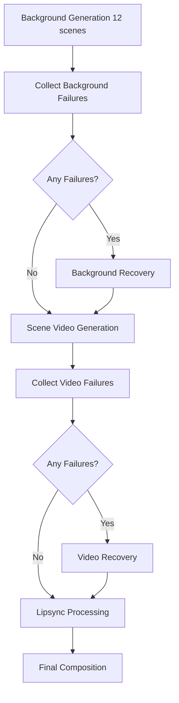

# 🔄 Robust Generation Workflow Patterns

## 🎯 Core Principle: Generation → Judgment → Recovery

**CRITICAL**: For any complex, heavy, or failure-prone generation tasks (image generation, video generation, audio synthesis, 3D modeling, etc.), always implement the **Generation-Judgment-Recovery** pattern.

## 📋 The Universal Pattern

### Pattern Structure
```yaml
generation-task:
  # Generate content (may fail partially)

judgment-task:
  needs: [generation-task]
  # Analyze success/failure of generation

recovery-task:  
  needs: [generation-task, judgment-task]
  if: judgment-task detects failures
  # Recover only failed items

next-phase-task:
  needs: [generation-task, judgment-task, recovery-task]
  if: always() && (recovery-task.success || recovery-task.skipped)
  # Proceed with available content
```

### Flow Decision Logic
```
Generation → Judgment → Decision:
                       ├── ✅ All Success → Next Phase
                       └── ❌ Failures → Recovery → Next Phase
```

## 🎨 Pattern Implementation Examples

### 1. Image Generation Pattern
```yaml
# 1️⃣ Generation Phase
background-generation:
  strategy:
    matrix:
      scene: [1, 2, 3, 4, 5, 6, 7, 8, 9, 10, 11, 12]
    fail-fast: false
  # Generate all 12 scene backgrounds

# 2️⃣ Judgment Phase  
collect-background-failures:
  needs: [background-generation]
  # Detect which scenes failed generation

# 3️⃣ Recovery Phase (Conditional)
background-recovery:
  needs: [background-generation, collect-background-failures]
  if: collect-background-failures.outputs.has_failures == 'true'
  # Regenerate ONLY failed scenes

# 4️⃣ Next Phase (Always)
scene-video-generation:
  needs: [background-generation, collect-background-failures, background-recovery]
  if: |
    always() &&
    (background-recovery.result == 'success' || background-recovery.result == 'skipped')
  # Use all available backgrounds (original + recovered)
```

### 2. Video Generation Pattern
```yaml
# 1️⃣ Generation Phase
scene-video-generation:
  strategy:
    matrix:
      scene: [1, 2, 3, 4, 5, 6, 7, 8, 9, 10, 11, 12]
    fail-fast: false
  # Generate all scene videos

# 2️⃣ Judgment Phase
collect-video-failures:
  needs: [scene-video-generation]
  # Detect which video generations failed

# 3️⃣ Recovery Phase (Conditional)
video-recovery:
  needs: [scene-video-generation, collect-video-failures]
  if: collect-video-failures.outputs.has_failures == 'true'
  # Regenerate ONLY failed videos

# 4️⃣ Next Phase (Always)
lipsync-processing:
  needs: [scene-video-generation, collect-video-failures, video-recovery]
  if: |
    always() &&
    (video-recovery.result == 'success' || video-recovery.result == 'skipped')
  # Process with all available videos
```

### 3. Audio Synthesis Pattern
```yaml
# 1️⃣ Generation Phase
narration-generation:
  strategy:
    matrix:
      segment: [1, 2, 3, 4, 5]
    fail-fast: false
  # Generate all narration segments

# 2️⃣ Judgment Phase
collect-audio-failures:
  needs: [narration-generation]
  # Detect audio generation failures

# 3️⃣ Recovery Phase (Conditional)
audio-recovery:
  needs: [narration-generation, collect-audio-failures]
  if: collect-audio-failures.outputs.has_failures == 'true'
  # Regenerate failed audio segments

# 4️⃣ Next Phase (Always)
audio-mixing:
  needs: [narration-generation, collect-audio-failures, audio-recovery]
  if: |
    always() &&
    (audio-recovery.result == 'success' || audio-recovery.result == 'skipped')
  # Mix available audio segments
```

## 🛡️ Why This Pattern is Essential

### Problem Without Pattern
```yaml
# ❌ PROBLEMATIC: Direct dependency
scene-video-generation:
  needs: [background-generation]
  # If any background fails → ALL videos fail → WORKFLOW TERMINATES
```

### Solution With Pattern
```yaml
# ✅ ROBUST: Generation-Judgment-Recovery
scene-video-generation:
  needs: [background-generation, collect-background-failures, background-recovery]
  # If backgrounds fail → Recovery attempts → Videos use available content → WORKFLOW CONTINUES
```

## 🔧 Implementation Guidelines

### 1. Matrix Strategy Configuration
```yaml
strategy:
  matrix:
    item: ${{ fromJson(needs.setup.outputs.item_array) }}
  fail-fast: false  # CRITICAL: Must be false for partial success
  max-parallel: 4   # Optimize for resource constraints
```

### 2. Failure Detection Logic
```yaml
collect-failures:
  steps:
    - name: Analyze Generation Results
      run: |
        FAILED_ITEMS=""
        SUCCESS_COUNT=0
        TOTAL_COUNT=${{ strategy.job-total }}
        
        for item in ${{ matrix.items }}; do
          if [ ! -f "output_${item}.ext" ] || [ $(stat -c%s "output_${item}.ext") -lt 1000 ]; then
            FAILED_ITEMS="${FAILED_ITEMS} ${item}"
          else
            SUCCESS_COUNT=$((SUCCESS_COUNT + 1))
          fi
        done
        
        if [ -n "$FAILED_ITEMS" ]; then
          echo "has_failures=true" >> $GITHUB_OUTPUT
          echo "failed_items=${FAILED_ITEMS}" >> $GITHUB_OUTPUT
        else
          echo "has_failures=false" >> $GITHUB_OUTPUT
        fi
        
        echo "success_rate=$((SUCCESS_COUNT * 100 / TOTAL_COUNT))%" >> $GITHUB_OUTPUT
```

### 3. Recovery Targeting Logic
```yaml
recovery-task:
  strategy:
    matrix:
      failed_item: ${{ fromJson(needs.collect-failures.outputs.failed_items) }}
  steps:
    - name: Targeted Recovery
      run: |
        # Only regenerate the specific failed item
        echo "Recovering item: ${{ matrix.failed_item }}"
        # Recovery logic here
```

### 4. Next Phase Continuation Logic
```yaml
next-phase:
  needs: [generation, collect-failures, recovery]
  if: |
    always() &&
    (recovery.result == 'success' || recovery.result == 'skipped') &&
    needs.collect-failures.result == 'success'
  steps:
    - name: Process Available Content
      run: |
        # Work with all available content (original successes + recovered items)
        echo "Processing with available content..."
```

## 🎯 Application Areas

### Must Use This Pattern For:
- **Image Generation**: T2I, I2I, background generation, character creation
- **Video Generation**: T2V, I2V, video editing, animation
- **Audio Synthesis**: TTS, music generation, sound effects
- **3D Modeling**: Model generation, texture creation, scene building
- **Complex API Calls**: External service integration with high failure rates
- **File Processing**: Large file transformations, format conversions

### Pattern Adaptations:
- **Single Item**: Still use pattern but with single-item matrix
- **Batch Processing**: Group items into batches, apply pattern per batch
- **Nested Dependencies**: Apply pattern at each dependency level
- **Time-Critical**: Adjust timeout and retry parameters

## 📊 Success Metrics

### Target Success Rates:
- **Initial Generation**: 60-80% success rate expected
- **After Recovery**: 85-95% final success rate target
- **Workflow Completion**: 99% completion rate (even with partial content)

### Monitoring Points:
- Generation success rate per item type
- Recovery effectiveness rate
- Time cost of recovery vs initial generation
- Final workflow completion rate

## 🚨 Critical Implementation Rules

### 1. Never Terminate on Partial Failure
```yaml
# ❌ NEVER DO THIS
if: needs.generation.result == 'success'

# ✅ ALWAYS DO THIS
if: |
  always() &&
  (recovery.result == 'success' || recovery.result == 'skipped')
```

### 2. Always Use `fail-fast: false`
```yaml
strategy:
  matrix:
    item: [1, 2, 3, 4, 5]
  fail-fast: false  # MANDATORY for partial success handling
```

### 3. Target Only Failed Items in Recovery
```yaml
# ✅ CORRECT: Targeted recovery
strategy:
  matrix:
    failed_item: ${{ fromJson(needs.collect-failures.outputs.failed_items) }}

# ❌ WRONG: Regenerate everything
strategy:
  matrix:
    item: [1, 2, 3, 4, 5]  # Don't regenerate successful items
```

### 4. Use `always()` for Continuation Logic
```yaml
next-phase:
  needs: [generation, judgment, recovery]
  if: |
    always() &&  # Continue even if generation had partial failures
    needs.judgment.result == 'success'
```

## 🔗 Integration with Meta-Workflow

When using meta-workflow generation, specify this pattern requirement:

```yaml
workflow_requirements:
  generation_pattern: "generation-judgment-recovery"
  failure_tolerance: "partial"
  recovery_strategy: "targeted"
  
generation_jobs:
  - type: "image_generation"
    pattern: "generation-judgment-recovery"
    recovery_methods: ["mcp_retry", "different_algorithm", "fallback_local"]
  
  - type: "video_generation" 
    pattern: "generation-judgment-recovery"
    recovery_methods: ["mcp_retry", "ffmpeg_fallback", "simplified_parameters"]
```

## 💡 Pattern Benefits

1. **Reliability**: Workflows complete even with partial failures
2. **Efficiency**: Only regenerate what actually failed
3. **Resource Optimization**: Don't waste compute on successful items
4. **User Experience**: Always deliver results (partial > none)
5. **Debugging**: Clear failure isolation and recovery tracking
6. **Scalability**: Pattern works from 1 item to 1000+ items

## 🎬 Real-World Example: News Video Production



This pattern ensures that a news video workflow completes successfully even if 30-50% of individual generation tasks fail, by systematically recovering only the failed components while preserving successful ones.

---

**Remember**: Complex generation tasks WILL fail partially. This pattern transforms inevitable partial failures into reliable, complete workflows.