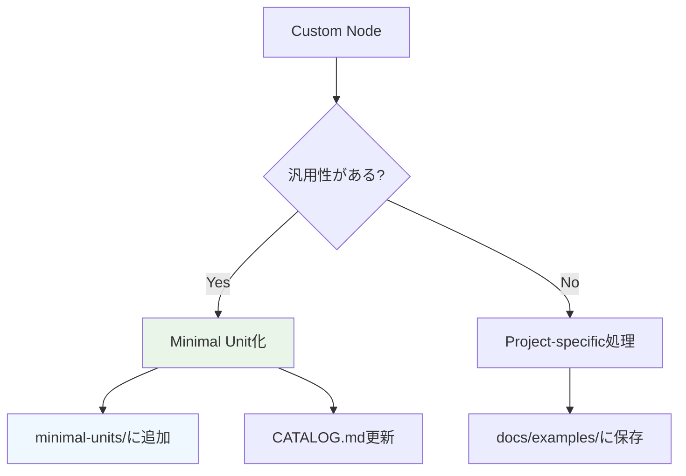

# Custom Node Examples

Meta Workflow Generator System における**カスタムノード**の実装例集です。

## 📋 Overview

**カスタムノード**は、既存の53個のミニマルユニットでは対応できない特殊な処理を実装するためのジョブです。これらの例は、よくある拡張要求に対する実装パターンを提供します。

## 🎯 使用場面

### 既存ユニットで対応できない場合
- 複数のMCPサービスを組み合わせた複合処理
- 特殊な条件分岐やループ処理
- 外部APIとの連携処理
- 大量データの分割処理

### ワークフロー特有の処理
- プロジェクト固有のビジネスロジック
- 特殊な形式での出力整形
- 複数フォーマット間の変換処理

## 📂 Examples Categories

### 🔄 データ処理 (data-processing/)
- **batch-processor.yml**: 大量データの分割バッチ処理
- **format-converter.yml**: 複数フォーマット間の変換
- **data-merger.yml**: 複数ソースからのデータ統合

### 🌐 外部連携 (external-integration/)
- **api-aggregator.yml**: 複数APIからの情報収集
- **webhook-processor.yml**: Webhook受信・処理
- **database-sync.yml**: 外部DBとの同期処理

### 🎨 メディア処理 (media-processing/)
- **multi-format-generator.yml**: 同一コンテンツの複数フォーマット生成
- **quality-optimizer.yml**: AI生成コンテンツの品質最適化
- **watermark-processor.yml**: ウォーターマーク・ブランディング処理

### 🚀 デプロイメント (deployment/)
- **multi-platform-deploy.yml**: 複数プラットフォームへの同時配信
- **cdn-uploader.yml**: CDN・ストレージへのアップロード
- **seo-optimizer.yml**: SEO最適化処理

### 🔧 ユーティリティ (utilities/)
- **health-checker.yml**: システムヘルスチェック
- **resource-monitor.yml**: リソース使用量監視
- **cleanup-manager.yml**: 自動クリーンアップ処理

## 🛠️ Implementation Guidelines

### 基本構造
```yaml
custom-node-name:
  runs-on: ubuntu-latest
  needs: [prerequisite-jobs]
  outputs:
    result: ${{ steps.process.outputs.result }}
  steps:
    - name: Checkout
      uses: actions/checkout@v4
      
    - name: Setup Environment
      run: |
        # 環境準備処理
        
    - name: Main Processing
      id: process
      run: |
        # メイン処理実装
        echo "result=success" >> $GITHUB_OUTPUT
        
    - name: Error Handling
      if: failure()
      run: |
        # エラーハンドリング
```

### 品質基準
- **エラーハンドリング**: すべての外部呼び出しにエラー処理を実装
- **出力の一貫性**: 他のミニマルユニットと同じ出力フォーマット
- **再利用性**: 汎用的なパラメータ設計
- **ドキュメント**: 用途と使用方法を明記

### 統合ガイドライン
- **ミニマルユニット化**: 汎用性があれば新しいミニマルユニットとして切り出し
- **依存関係管理**: 他のジョブとの依存関係を明確に定義
- **並列処理対応**: 可能な限り並列実行に対応

## 📈 Evolution Path



## 🔍 Finding the Right Pattern

### 1. 既存ユニット確認
まず**MINIMAL_UNITS_CATALOG.md**で既存の53ユニットをチェック

### 2. カテゴリ判定
処理内容に基づいて適切なカテゴリの例を参照

### 3. カスタマイズ
例をベースに具体的な要求に合わせてカスタマイズ

### 4. 統合テスト
他のジョブとの組み合わせでテスト実行

---

**Meta Workflow Generator System v9.0**  
**Last Updated**: 2025-07-31