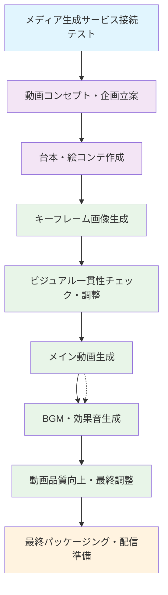
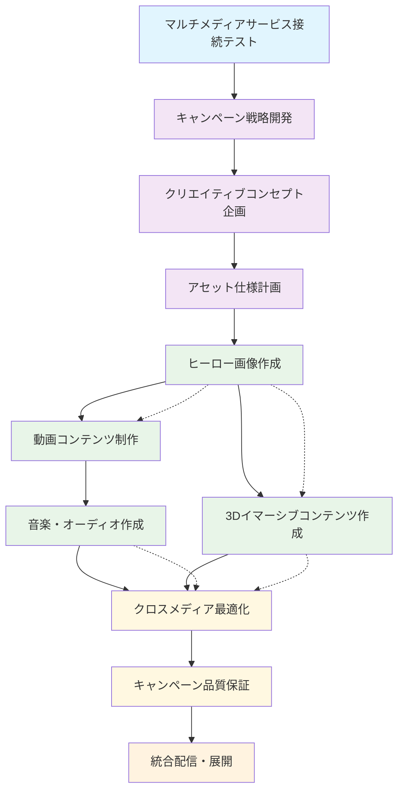
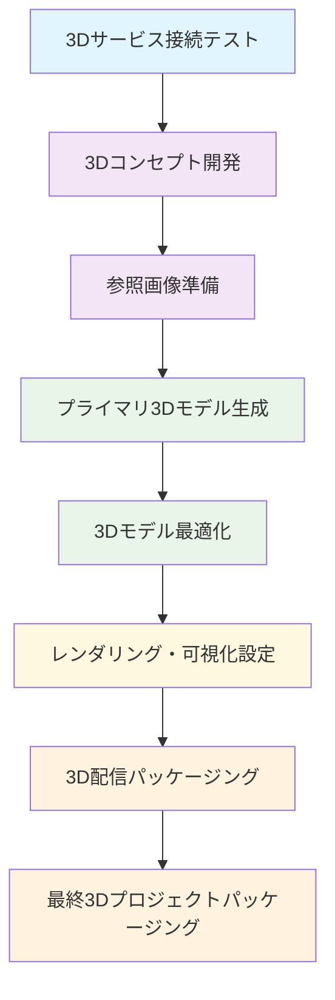
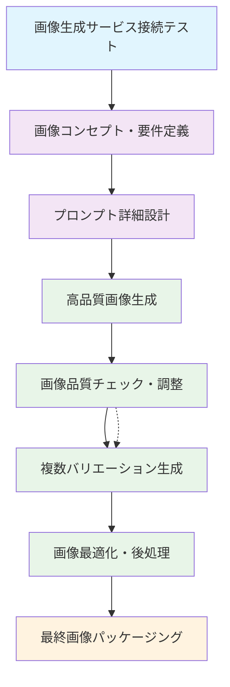
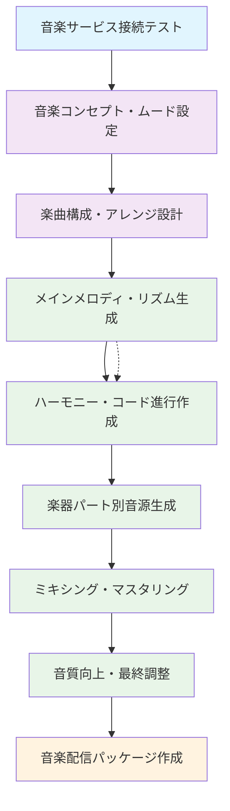
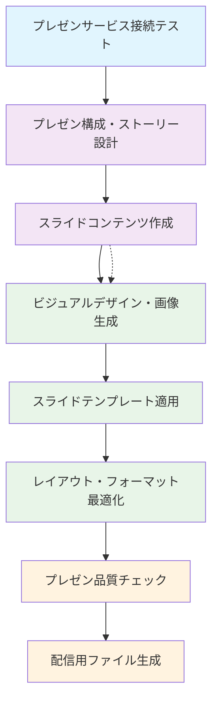
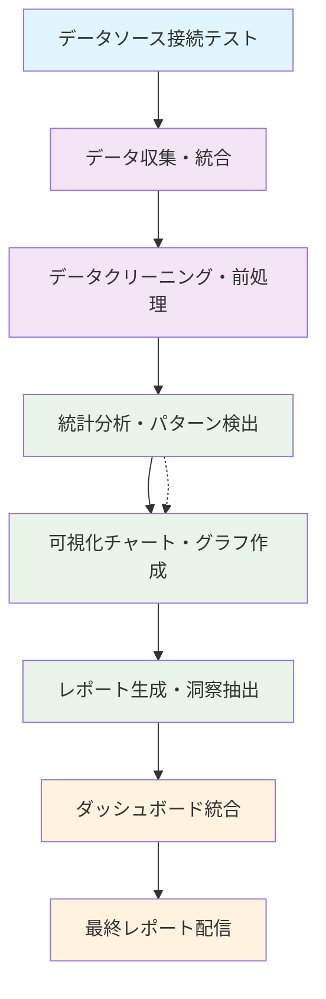
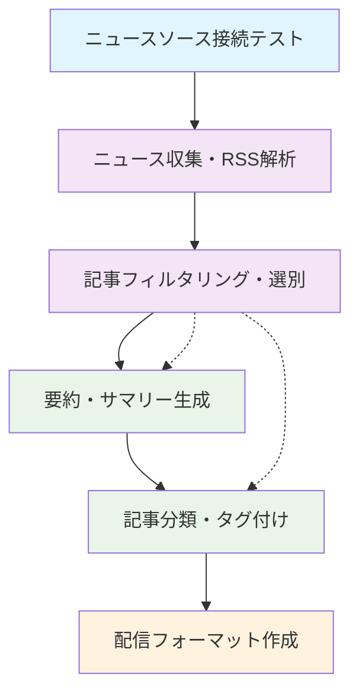
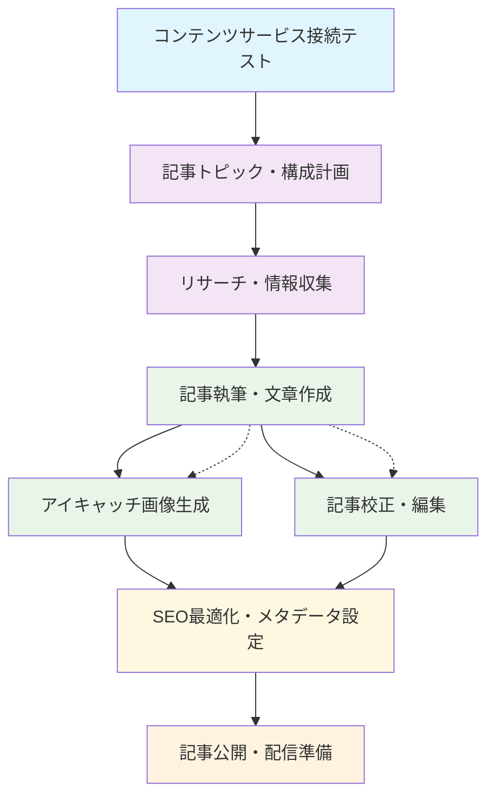

# Meta Workflow Examples

このディレクトリには、**Meta Workflow Executor v8**で使用される参考ワークフローテンプレートが格納されています。

## 概要

各ワークフローは**超詳細タスク分解**により、AIが確実に実行できる粒度まで分解された完全なワークフロー定義です。**Meta Workflow Executor v8**は、ユーザーのステップバック回答に基づいてこれらのテンプレートから適切なものを選択し、3つのアプローチ（テンプレートベース・動的組み立て・ハイブリッド）で並列生成して最適なワークフローを自動選択します。

## ワークフロー一覧

### 🎥 **動画・映像制作系**

#### `video-content-creation.yml` - フロー図



#### `video-content-creation.yml`
- **概要**: テキスト→画像→動画→音声の完全な動画コンテンツ制作フロー
- **複雑度**: Level 5 (最高)
- **所要時間**: 45分
- **主要MCP**: T2V (veo3-fast), I2V (hailuo-02-pro), V2A (metavoice-v1)
- **タスク数**: 14タスク
- **適用場面**: YouTubeコンテンツ、プロモーション動画、教育動画

#### `multimedia-ad-campaign.yml` - フロー図



#### `multimedia-ad-campaign.yml`
- **概要**: 統合マルチメディア広告キャンペーン制作（全メディア対応）
- **複雑度**: Level 5 (最高)
- **所要時間**: 60分
- **主要MCP**: 全MCP統合 (T2I, T2V, I2V, T2M, V2A, I2I3D)
- **タスク数**: 16タスク
- **適用場面**: 企業広告キャンペーン、ブランディング、商品プロモーション

### 🖼️ **画像・3D制作系**

#### `3d-model-creation.yml` - フロー図



#### `3d-model-creation.yml`
- **概要**: 2D画像から3Dモデル生成・最適化
- **複雑度**: Level 4
- **所要時間**: 30分
- **主要MCP**: I2I3D (hunyuan3d-v21), T2I (imagen3)
- **タスク数**: 10タスク
- **適用場面**: プロダクトデザイン、ゲーム開発、建築可視化

#### `image-generation.yml` - フロー図



#### `image-generation.yml`
- **概要**: テキストプロンプトからの高品質画像生成
- **複雑度**: Level 3
- **所要時間**: 20分
- **主要MCP**: T2I (imagen3, imagen4-ultra)
- **タスク数**: 8タスク
- **適用場面**: イラスト制作、コンセプトアート、マーケティング素材

### 🎵 **音楽・音声制作系**

#### `audio-music-creation.yml` - フロー図



#### `audio-music-creation.yml`
- **概要**: 音楽作曲・音声コンテンツ制作
- **複雑度**: Level 4
- **所要時間**: 35分
- **主要MCP**: T2M (google-lyria), V2A (metavoice-v1)
- **タスク数**: 11タスク
- **適用場面**: BGM制作、ポッドキャスト、音声ガイド

### 📊 **ビジネス・分析系**

#### `presentation-slide-creation.yml` - フロー図



#### `presentation-slide-creation.yml`
- **概要**: ビジネスプレゼンテーション作成（コンテンツ＋デザイン）
- **複雑度**: Level 3
- **所要時間**: 40分
- **主要MCP**: T2I (imagen3), 外部API (Google Slides)
- **タスク数**: 12タスク
- **適用場面**: 企業プレゼン、提案書、報告資料

#### `data-analysis-visualization.yml` - フロー図



#### `data-analysis-visualization.yml`
- **概要**: データ収集から可視化・レポート生成
- **複雑度**: Level 4
- **所要時間**: 45分
- **主要MCP**: T2I (グラフ・チャート生成), 外部API (GitHub)
- **タスク数**: 8タスク
- **適用場面**: 業績レポート、分析ダッシュボード、KPI追跡

### 📰 **コンテンツ制作系**

#### `news-summarization.yml` - フロー図



#### `news-summarization.yml`
- **概要**: ニュース収集・要約・配信
- **複雑度**: Level 2
- **所要時間**: 25分
- **主要MCP**: なし (外部API使用)
- **タスク数**: 6タスク
- **適用場面**: ニュースレター、業界レポート、情報収集

#### `blog-article-creation.yml` - フロー図



#### `blog-article-creation.yml`
- **概要**: ブログ記事・記事コンテンツ制作
- **複雑度**: Level 3
- **所要時間**: 35分
- **主要MCP**: T2I (アイキャッチ画像)
- **タスク数**: 9タスク
- **適用場面**: ブログ運営、コンテンツマーケティング、記事執筆

## 技術仕様

### MCP (Model Context Protocol) サービス

各ワークフローで使用される主要なMCPサービス（`.claude/mcp-kamuicode.json`で定義）：

- **T2I (Text-to-Image)**
  - `t2i-google-imagen3`: Google Imagen 3
  - `t2i-fal-imagen4-ultra`: Fal.ai Imagen 4 Ultra
  - `t2i-fal-imagen4-fast`: Fal.ai Imagen 4 Fast

- **T2V (Text-to-Video)**  
  - `t2v-fal-veo3-fast`: Fal.ai Veo3 Fast

- **I2V (Image-to-Video)**
  - `i2v-fal-hailuo-02-pro`: Fal.ai Hailuo 0.2 Pro

- **T2M (Text-to-Music)**
  - `t2m-google-lyria`: Google Lyria

- **V2A (Video-to-Audio)**
  - `v2a-fal-thinksound`: Fal.ai ThinkSound ⚠️ **注意**: 旧文書の`v2a-fal-metavoice-v1`から変更

- **V2V (Video-to-Video)**
  - `v2v-fal-luma-ray2-modify`: Fal.ai Luma Dream Machine Ray-2 ⚠️ **注意**: 旧文書の`v2v-fal-cogvideo-1_5`から変更

- **I2I3D (Image-to-3D)**
  - `i2i3d-fal-hunyuan3d-v21`: Fal.ai HunYuan3D v2.1

- **R2V (Reference-to-Video)**
  - `r2v-fal-vidu-q1`: Fal.ai Vidu Q1

- **I2I (Image-to-Image)**
  - `i2i-fal-flux-kontext-max`: Fal.ai Flux Kontext Max

### ファイル構造パターン

全ワークフローは一貫したファイルパス参照パターンを使用：

```bash
# MCP出力からのファイルパス取得（成功パターンドキュメント参照）
IMAGE_PATH=$(jq -r '.image_url // .file_path // "none"' "$ref_file" 2>/dev/null)
VIDEO_PATH=$(jq -r '.video_url // .file_path // "none"' "$video_file")
AUDIO_PATH=$(jq -r '.audio_url // .file_path // "none"' "$audio_file")

# 統一されたディレクトリ構造（meta/successful-workflow-patterns.md準拠）
mkdir -p generated/workflows/staging/approach-{1,2,3}
mkdir -p generated/workflows/selected
mkdir -p generated/workflows/production
mkdir -p generated/metadata/{stepback-analysis,requirement-analysis,task-decomposition,evaluation}
mkdir -p generated/logs/run-${GITHUB_RUN_NUMBER}-${TIMESTAMP}
```

### GitHub Actions 統合

各ワークフローは以下の構造に従います：

- **Artifacts**: 30日間保持
- **並列実行**: 最大3ジョブ
- **エラーハンドリング**: echo方式ファイル生成でHEREDOC回避
- **品質チェック**: YAML構文・GitHub Actions構造・依存関係の検証
- **ログ記録**: `generated/logs/` での詳細な実行ログ永続化
- **オートフィックス**: 失敗時の自動修復システム (`auto-fix-deployment.yml`) 統合

## 使用方法

### 1. Meta Workflow Executor v8経由（推奨）

**Issue作成による実行**:
```markdown
## 🤖 Kamuicode Meta Workflow Generator v8 - ステップバック質問回答

### ワークフロー種別
動画生成（video-generation）- T2V/I2V

### 詳細な説明・ストーリー
商品紹介動画を作成したい。T2I→I2V複合処理で高品質な動画を生成。

## 📋 ワークフロー詳細化のための質問

**Q1回答**: T2I→I2V複合処理を採用
**Q2回答**: 最高品質設定で時間制限なし
**Q3回答**: エラー時は異なるMCPサービスに切り替え
**Q4回答**: URLプレビュー可能、中間ファイルも保持
**Q5回答**: 詳細監視・ログ機能を組み込み
```

**手動実行**:
```bash
gh workflow run meta-workflow-executor-v8.yml -f issue_number=46
```

### 2. 直接使用（開発者向け）

```bash
# テンプレートをコピーしてカスタマイズ
cp meta/examples/video-content-creation.yml .github/workflows/my-video-workflow.yml

# GitHub Actions として実行
gh workflow run my-video-workflow.yml
```

### 3. カスタマイズ

各ワークフローは以下の箇所をカスタマイズ可能：

- **タイトル・説明**: ワークフロー名とdescription
- **パラメータ**: inputs セクションのデフォルト値
- **MCP設定**: 使用するAI生成サービスの選択
- **並列度**: parallel_group の調整
- **品質基準**: validation セクションの要件

## 品質保証

### 段階的格納システム v8

1. **3-Approach Staging**: `generated/workflows/staging/approach-{1,2,3}/` で並列生成
2. **Best Selection**: 最高スコアのアプローチを `generated/workflows/selected/` に選択
3. **Validation**: YAML構文・GitHub Actions構造・MCP参照チェック
4. **Staging Deployment**: `.github/workflows/generated/staging/` に `.disabled` 付きで配置
5. **Active Ready**: `.github/workflows/generated/active/` に配置（手動アクティベーション待ち）

### 検証項目

- ✅ YAML構文チェック (Python yaml.safe_load)
- ✅ GitHub Actions構造検証 (必須フィールド確認)
- ✅ MCPサービス参照検証 (`.claude/mcp-kamuicode.json` 準拠)
- ✅ 依存関係チェック（循環参照防止）
- ✅ 総合スコア判定 (75点以上で合格)
- ✅ オートフィックス (`auto-fix-deployment.yml`) 統合

## 拡張・カスタマイズ

### 新しいワークフロー追加

1. 既存テンプレートをベースに作成
2. 超詳細タスク分解を適用
3. MCP統合とファイルパス参照パターンを実装
4. `README.md` に追加

### 品質向上

- **並列実行最適化**: タスクの依存関係を最小化
- **エラーハンドリング強化**: フォールバック戦略の追加
- **MCP統合拡張**: 新しいAI生成サービスの組み込み
- **外部API連携**: より多くのサードパーティサービス統合

---

Generated by Meta Workflow Generator v3 (Staged Deployment) 🤖🔄✅

**開発者**: [Kamui Rossy System](https://github.com/username/kamui_rossy)  
**最終更新**: 2025-07-25