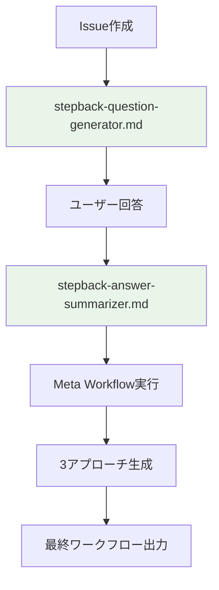

# Meta Workflow Prompts

Meta Workflow Executor v8.1 で使用されるプロンプトファイルの管理ディレクトリです。

## 📁 アクティブなプロンプト

### **stepback-question-generator.md**
- **用途**: ユーザーのワークフロー要求を分析し、詳細化のための質問を動的生成
- **使用場面**: Issue作成時の要求分析
- **出力先**: `generated/metadata/stepback-analysis/generated-questions.md`
- **実装状況**: ✅ v8.1で使用中

### **stepback-answer-summarizer.md**
- **用途**: ユーザーの詳細回答を GitHub Actions 抽出用の簡潔形式に要約
- **使用場面**: ワークフロー生成前の回答処理
- **出力形式**: `Q[1-5]回答:` パターン
- **実装状況**: ✅ v8.1で使用中

## 📂 テンプレート

### **templates/task-prompt-template.md**
- **用途**: 個別タスク実行用のプロンプトテンプレート
- **変数**: `{{task_name}}`, `{{task_description}}` など
- **実装状況**: 🔄 将来の機能拡張用

## 🗂️ 非アクティブなプロンプト

### **deprecated/** ディレクトリ
v8.1アーキテクチャで使用されなくなったプロンプトファイルが保管されています：
- `task-decomposition.md` - 複雑なタスク分解（フォールバックJSONで代替）
- `workflow-generation.md` - ワークフロー生成（echo-based直接生成で代替）
- `script-generation.md` - JavaScript実行エンジン（GitHub Actions直接実行で代替）
- `documentation-generation.md` - 自動ドキュメント生成（手動作成で代替）

## 🔄 Meta Workflow v8.1 での使用フロー

## 📝 プロンプト追加ガイドライン

新しいプロンプトファイルを追加する際は：

1. **明確な用途**: 何のために使用されるかを明記
2. **出力先指定**: `generated/metadata/` 以下の適切な場所
3. **変数定義**: `{{variable_name}}` 形式で統一
4. **エラーハンドリング**: フォールバック戦略を含める
5. **ドキュメント更新**: このREADMEと`CLAUDE.md`に追記

## 🔧 メンテナンス

- **定期見直し**: 四半期ごとに使用状況を確認
- **廃止プロンプト**: deprecated/ ディレクトリに移動
- **バージョン管理**: メジャーアップデート時に構造見直し

---

**Meta Workflow Executor v8.1**  
**Last Updated**: 2025-07-27