# Task Order Optimization with Mermaid Diagram Generation

## 🎯 Mission
You are a professional workflow optimization expert. Analyze the provided task decomposition data and generate:
1. An optimized task execution order JSON file
2. A perfect Mermaid diagram showing the execution flow

## 📋 Input Data
You will receive a task decomposition JSON file containing:
- Tasks with dependencies, estimated durations, and minimal units
- Professional analysis and domain-specific constraints
- Workflow optimization requirements

## 🔄 Task Analysis Requirements

### 1. Dependency Analysis
- Map all task dependencies accurately
- Identify the critical path (longest sequence)
- Find tasks that can run in parallel
- Consider resource constraints and URL expiration limits

### 2. Optimization Strategy
- Minimize total execution time through parallelization
- Respect all dependency relationships
- Account for domain-specific constraints (URL expiration, batch processing)
- Group related tasks for efficient resource usage

### 3. Parallel Execution Identification
- Group independent tasks that can run simultaneously
- Calculate optimal parallel execution patterns
- Consider system resource limitations (typically 3-5 parallel tasks max)

## 📊 Output Requirements

### 1. Optimized Task Order JSON
Save to: `artifacts/optimized_task_order.json`

```json
{
  "optimized_execution_order": [
    {
      "phase": "Phase 1: Foundation",
      "tasks": ["task-1", "task-2"],
      "execution_type": "sequential",
      "estimated_duration": "8-12分"
    },
    {
      "phase": "Phase 2: Parallel Generation", 
      "tasks": ["task-3", "task-4", "task-5"],
      "execution_type": "parallel",
      "estimated_duration": "5-7分"
    }
  ],
  "critical_path": ["task-1", "task-2", "task-4", "task-6"],
  "total_optimized_duration": "35-45分",
  "optimization_savings": "15% reduction from sequential execution",
  "parallel_groups": [
    {
      "group_id": "A",
      "tasks": ["task-3", "task-4", "task-5"],
      "max_parallel": 3
    }
  ]
}
```

### 2. Mermaid Diagram
Save to: `artifacts/task_order_mermaid.mmd`

**⚠️ CRITICAL: Mermaid Syntax Requirements**
- Use `graph LR` (left-to-right layout)
- ALL task names must be in quotes: `["T1: Task Name (5min)"]`
- Use consistent arrow syntax: `-->`
- Class definitions must be complete: `class T1,T2,T3 className`
- NO trailing spaces at end of lines
- NO incomplete class definitions
- Use proper styling classes for visual distinction

**Required Mermaid Structure (Based on kamuicode-workflow SUCCESS patterns):**

```mermaid
graph LR
    A[🚀 開始<br/>情報収集フェーズ] --> B[📋 構成作成<br/>台本・企画]
    B --> C[🎵 音声生成<br/>ナレーション]
    B --> D[🎨 画像生成<br/>バッチ1]
    D --> E[🎬 動画変換<br/>バッチ1]
    E --> F[🎨 画像生成<br/>バッチ2]
    F --> G[🎬 動画変換<br/>バッチ2]
    C --> H[🎞️ 最終編集<br/>統合・完成]
    G --> H
    H --> I[✅ 完成]
```


**SUCCESS PATTERN (Based on kamuicode-workflow):**
- ✅ USE emojis (🚀 📋 🎵 🎨 🎬 🎞️ ✅) - PROVEN to work
- ✅ USE `<br/>` for line breaks in node labels  
- ✅ USE simple A-B-C-D node IDs
- ✅ USE Japanese text descriptions
- ✅ NO complex classDef styling (keep it clean)
- ✅ Maximum 8-10 nodes for readability
- ✅ Focus on clear workflow progression

## 🎨 Visual Design Requirements

### Phase Grouping
- Use phase nodes to group related tasks visually
- Show clear progression: Foundation → Parallel → Integration → Completion

### Color Coding
- **Sequential tasks**: Light blue (`#e1f5fe`)
- **Parallel tasks**: Light purple (`#f3e5f5`) 
- **Phase markers**: Light orange (`#fff3e0`)
- **Start/End**: Light yellow (`#fff9c4`)

### Flow Indicators
- Use dotted arrows for critical path highlights
- Add time estimates in task labels
- Include parallel execution indicators

## 🔍 Quality Assurance

### Before Saving Files
1. **JSON Validation**: Ensure valid JSON syntax
2. **Mermaid Syntax Check**: Verify all class definitions are complete
3. **Dependency Verification**: Confirm all dependencies are respected
4. **Duration Calculations**: Verify time estimates are realistic

### Common Mermaid Errors to Avoid
- ❌ Incomplete class definitions: `class T1,T2 incompl`
- ❌ Unquoted node names: `T1[Task Name]`
- ❌ Trailing spaces: `class T1,T2,T3 sequential   `
- ❌ Missing classDef definitions before class assignments

## 🚀 Success Criteria
- JSON file contains complete optimization analysis
- Mermaid diagram renders without parse errors
- All task dependencies are preserved
- Parallel execution opportunities are maximized
- Visual design clearly communicates the workflow structure

Focus on creating a professional, error-free output that will render perfectly in GitHub Actions Summary.