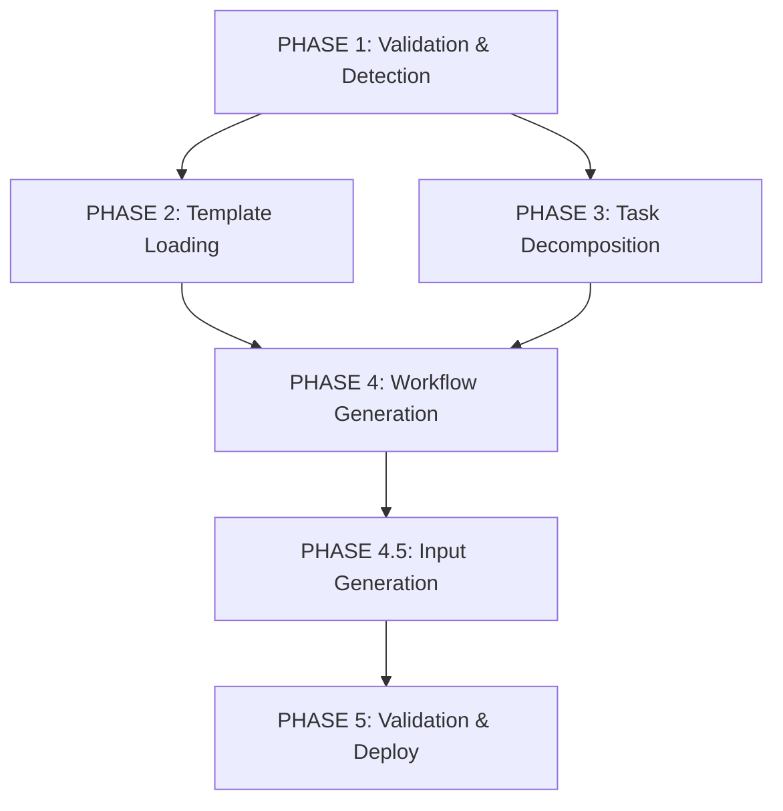

# メタワークフロー最適化分析

## 現状のフロー（v11）

1. **PHASE 1: Issue Validation & Domain Detection**
   - Issue情報の取得
   - ドメイン自動検出
   - ✅ 効率的

2. **PHASE 2: Domain Template Loading**
   - テンプレートの読み込み
   - チャンク分割
   - ✅ 文字数制限対応済み

3. **PHASE 3: Professional Task Decomposition**
   - 専門家視点でのタスク分解
   - 依存関係の分析
   - ✅ ドメイン知識活用

4. **PHASE 4: Constraint-Aware Workflow Generation**
   - ワークフロー生成
   - 制約条件の適用
   - ⚠️ inputs生成が欠けている

5. **PHASE 5: Validation & Deployment**
   - YAML検証
   - デプロイ
   - ✅ 必要十分

## 改善提案

### 1. 新しいフェーズの追加
**PHASE 4.5: Professional Input Generation**
- ドメインテンプレートのinput-schema.yamlを参照
- 専門家視点でのworkflow_dispatch inputs生成
- 必須/推奨/オプションパラメータの設定

### 2. 並列実行の最適化
現在すべてのフェーズが直列実行だが、以下は並列化可能：



### 3. フェーズ間のデータフロー最適化

#### 現状の問題点
- 各フェーズが全アーティファクトをダウンロード
- 不要なデータも含まれる可能性

#### 改善案
- 必要最小限のデータのみを各フェーズに渡す
- アーティファクトの命名規則を明確化

### 4. エラーハンドリングの強化

#### 追加すべき処理
1. ドメインが検出できない場合のフォールバック
2. テンプレートが存在しない場合の汎用処理
3. 生成失敗時のリトライメカニズム

### 5. 実行時間の最適化

#### 現状の推定時間
- PHASE 1: 30秒
- PHASE 2: 20秒
- PHASE 3: 2-3分（Claude Code実行）
- PHASE 4: 3-5分（Claude Code実行）
- PHASE 5: 30秒
- **合計: 6-9分**

#### 並列化後の推定時間
- PHASE 1: 30秒
- PHASE 2&3（並列）: 2-3分
- PHASE 4: 3-5分
- PHASE 4.5: 1-2分
- PHASE 5: 30秒
- **合計: 7-11分**（inputs生成込み）

## 実装優先順位

1. **高優先度**: Professional Input Generation（PHASE 4.5）の追加
2. **中優先度**: エラーハンドリングの強化
3. **低優先度**: 並列実行の最適化（複雑度が高い）

## 技術的考慮事項

### workflow_dispatch inputs生成時の制約
- GitHub Actions inputsの制限
  - 最大10個のinputs
  - 各inputのdescriptionは1000文字以内
  - type: string, boolean, choice, environment のみ

### ドメイン固有inputs例

#### 動画制作ドメイン
```yaml
inputs:
  video_duration:
    description: '動画の長さ（秒）'
    required: true
    type: choice
    options: ['15', '30', '60', '120', '300']
    default: '60'
  
  video_style:
    description: '動画スタイル'
    required: true
    type: choice
    options: ['cinematic', 'documentary', 'animation', 'tutorial']
    default: 'cinematic'
  
  include_narration:
    description: 'ナレーション音声を含める'
    required: false
    type: boolean
    default: true
```

#### データ分析ドメイン
```yaml
inputs:
  data_source:
    description: 'データソースの種類'
    required: true
    type: choice
    options: ['csv', 'api', 'database', 'web_scraping']
    default: 'csv'
  
  analysis_type:
    description: '分析タイプ'
    required: true
    type: choice
    options: ['descriptive', 'predictive', 'prescriptive', 'diagnostic']
    default: 'descriptive'
  
  visualization_format:
    description: '可視化フォーマット'
    required: true
    type: choice
    options: ['dashboard', 'report', 'presentation', 'interactive']
    default: 'dashboard'
```

## 次のアクション

1. workflow-inputs-generator.pyスクリプトの作成
2. メタワークフローv12の実装（inputs生成フェーズ追加）
3. 各ドメインのinput-schema.yamlの活用