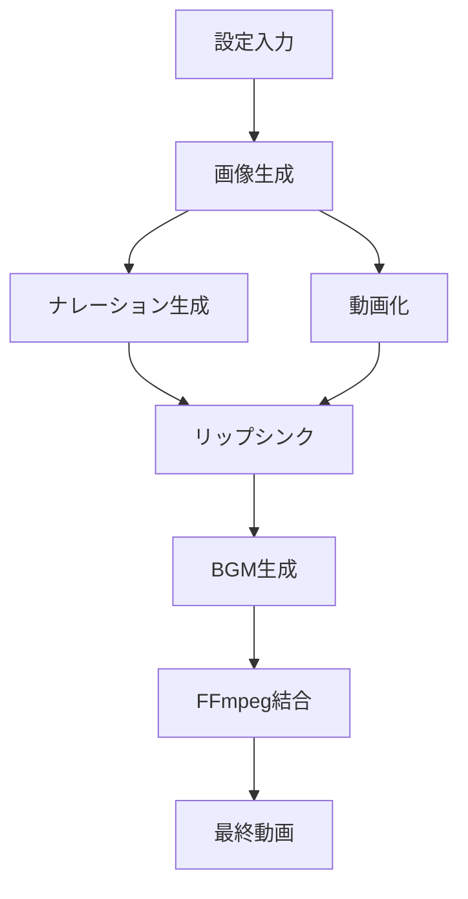

# ニュース動画生成スクリプト集

このディレクトリには、AI生成サービス（MCP）とFFmpegを組み合わせて、プロフェッショナルなニュース動画を自動生成するためのスクリプトが含まれています。

## 📁 ディレクトリ構造

```
news_video_scripts/
├── docs/
│   ├── README.md              # このファイル
│   ├── dependencies.md        # 依存関係の詳細
│   └── mcp_services.md        # MCPサービスの説明
├── scripts/
│   ├── mcp_news_video_generator.py    # メイン生成スクリプト
│   ├── ffmpeg_video_merger.py         # FFmpeg編集スクリプト
│   └── utils/                         # ユーティリティスクリプト
└── examples/
    ├── water_infrastructure_news.json  # 水道インフラニュースの例
    └── sample_workflow.sh              # ワークフロー例
```

## 🚀 クイックスタート

### 1. 依存関係のインストール

```bash
# Python依存関係
pip install imageio-ffmpeg requests

# システム依存関係（オプション）
# Ubuntu/Debian
sudo apt-get install ffmpeg

# macOS
brew install ffmpeg
```

### 2. 基本的な使用方法

```python
from scripts.mcp_news_video_generator import NewsVideoGenerator

# 設定
config = {
    'title_text': '水道インフラの危機',
    'script': 'ニュース原稿のテキスト...',
    'anchor_description': 'Professional news anchor'
}

# 動画生成
generator = NewsVideoGenerator(output_dir="./output")
final_video = generator.generate_news_video(config)
```

## 🎬 生成される動画の構成

1. **タイトルアニメーション** (5秒)
   - プロフェッショナルなタイトル画面
   - モーショングラフィックス効果

2. **キャスターによるニュース** (可変長)
   - リップシンク技術で音声と口の動きが同期
   - ナレーション音声付き

3. **BGM** (全編)
   - 控えめな音量で雰囲気を演出
   - ニュース番組風の音楽

## 🛠️ 主要コンポーネント

### MCP (Model Context Protocol) サービス

- **画像生成**: `t2i-fal-imagen4-fast/ultra`
- **動画生成**: `i2v-fal-hailuo-02-pro`
- **音声生成**: `t2s-fal-minimax-speech-02-turbo`
- **リップシンク**: `v2v-fal-creatify-lipsync`
- **BGM生成**: `t2m-google-lyria`

### FFmpeg処理

- 動画の結合
- 音声トラックの追加
- BGMのミックス
- フォーマット変換

## 📊 処理フロー



## ⚙️ カスタマイズ

### 画像プロンプトの変更

```python
# config内で指定
config = {
    'title_prompt_override': 'カスタムタイトルプロンプト',
    'anchor_style': 'male, suit, serious expression'
}
```

### BGM設定

```python
# BGMの詳細設定
bgm_config = {
    'style': 'orchestral',  # electronic, classical等
    'tempo': 'slow',        # medium, fast
    'duration': 90          # 秒数
}
```

### 出力品質

```python
# FFmpegエンコード設定
encoding_config = {
    'video_codec': 'libx264',
    'audio_codec': 'aac',
    'preset': 'medium',  # ultrafast, fast, medium, slow
    'crf': 23           # 品質（0-51、低いほど高品質）
}
```

## 🔧 トラブルシューティング

### FFmpegが見つからない

```python
# 明示的にパスを指定
editor = FFmpegVideoEditor(ffmpeg_path="/usr/local/bin/ffmpeg")
```

### メモリ不足

```python
# 低解像度で処理
config['resolution'] = '720p'  # デフォルトは1080p
```

### MCPサービスエラー

```python
# タイムアウトを延長
generator.timeout = 300  # 5分
```

## 📝 ライセンスと制限事項

- スクリプト自体はMITライセンス
- MCPサービスは各プロバイダーの利用規約に従う
- 生成されたコンテンツの著作権に注意

## 🤝 貢献方法

1. このリポジトリをフォーク
2. 機能ブランチを作成 (`git checkout -b feature/AmazingFeature`)
3. 変更をコミット (`git commit -m 'Add some AmazingFeature'`)
4. ブランチにプッシュ (`git push origin feature/AmazingFeature`)
5. プルリクエストを開く

## 📚 関連ドキュメント

- [依存関係の詳細](./dependencies.md)
- [MCPサービス一覧](./mcp_services.md)
- [サンプルワークフロー](../examples/sample_workflow.sh)